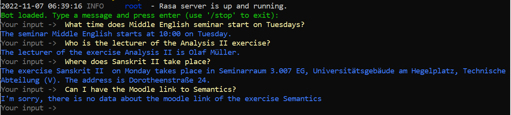

# Humbot: University Chatbot
A prototype of a University Chatbot created with Python

## Author
Iliyana Tarpova, business informatics student at Humboldt University of Berlin


## Project description
This project is part of the author's master thesis. Its aim is to prove whether 
the University System Agnes of Humboldt University of Berlin is suitable for an AI implementation.
For this reason, a prototype of a Question-Answering system in the form of a Chatbot was developed, named Humbot.

The underlying architecture for Humbot is [Rasa v.3](https://rasa.com/), and it is used 
for Natural Language Understanding and Dialogue Management.

## Features

Humbot gets as input a question about a university course from a predefined domain and outputs an answer.
There are two types of questions that can be answered:
* **Straightforward questions:** The answers are retrieved directly from the University database with predefined queries
  * the start time of a course
  * the lecturer of a course
  * the location of a course
  * the Moodle link to a course
* **Open questions (OQ):** The answers are generated by the Natural Language Processing model ELECTRA (Clark, 2020) from an unstructured text
    (the comment field about a course in the University database)
  * the course description (OQ)
  * the target group of a course (OQ)
  * the exam type of course (OQ)
  * whether a registration is necessary for a course (OQ)


For this project, only a subset of the available University data was taken into consideration.
The courses for which information is available can be found in the file *data/csv_exports/classes_to_choose_from.csv*

The project can either be connected to the University database for access to the full University data or to local files 
which contain a subset of it needed for the prototype. By default, this project connects to the local files.

*This can be changed with the variable MODE in the file actions/actions.py.*

Currently, Humbot is able to understand user questions in English, while class types and weekdays in both English and German.
The class name is understood in its original language.
Humbot struggles with extracting class names which consist of more than two words, but recognizes shorter ones with almost perfect accuracy.

This Chatbot could be further developed to answer more complex user requests and deliver information on various aspects 
of the student life. 

This project can be used as a base for the development of a virtual assistant not
only for the Humboldt University of Berlin, but for any other university as well.

## Technologies
* Python 3.8
* Rasa 3.2
* ELECTRA
* PostgreSQL 14

## Installation    

To be able to use Humbot, please create a virtual environment and install all 
requirements for the Chatbot there.

```bash
virtualenv <env_name>
<env_name>\Scripts\activate
pip install -r requirements.txt
```

The first time using Rasa, the following command should be run to initialize the project:

```bash
python -m rasa init 
```

## Usage

After the project is initialized and all required packages are installed, the Chatbot can be started with the following command in the virtual environment:

```bash
rasa run actions
```


In a new Command Prompt window activate the virtual environment once again and run the following command:

```bash
rasa shell
```


This will start the program and the user will be asked to input a question. Then the respective answer will be presented.

## Examples of use

Here is an example of what an interaction could look like:



## Training the model

A new model can be trained with the following command:

```bash
rasa train
```

For the development, Rasa interactive tool can be used to gain a better insight of 
the model decisions. There the developer can check if the intents and entities get 
recognized and correct the model when mistakes are made. Further, the conversation 
flow can be influenced and new user stories can be created. Activate the interactive 
tool with the following command:

```bash
rasa interactive
```

## References

Rasa. (2019). Rasa: Open source conversational AI. Retrieved from Rasa.com website: https://rasa.com/

Clark, K., Luong, M.-T., Le, Q. V., & Manning, C. D. (2020). ELECTRA: Pre-training Text Encoders as Discriminators Rather Than Generators. ArXiv:2003.10555.